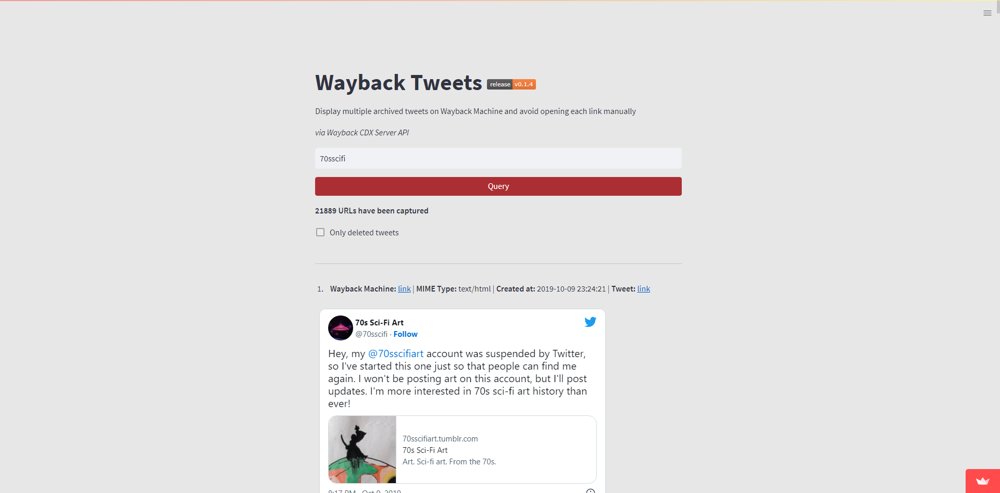

# 🏛️ Wayback Tweets

Tool that displays multiple archived tweets on Wayback Machine to avoid opening each link manually. Via [Wayback CDX Server API](https://github.com/internetarchive/wayback/tree/master/wayback-cdx-server).

    

    <a href="https://waybacktweets.streamlit.app">waybacktweets.streamlit.app</a>

*Thanks Tristan Lee for the idea.*

## Features

- 30 tweets per page
- Filtering by only deleted tweets

## Development

### Requirement

- Python 3.8+

### Installation

$ `git clone git@github.com:claromes/waybacktweets.git`

$ `cd waybacktweets`

$ `pip install -r requirements.txt`

$ `streamlit run app.py`

Streamlit will be served at http://localhost:8501

## Bugs

- [ ] "web.archive.org took too long to respond."
- [x] `only_deleted` checkbox selected for handles without deleted tweets
- [x] Pagination: set session variable on first click
- [x] Pagination: scroll to top

## Roadmap

- [x] Pagination
    - [x] Footer
    - [x] Disabled/ Empty
- [x] Feedbacks
- [ ] Download dataset
- [x] Review data cache
- [x] Changelog
- [ ] Prevent duplicate URLs
- [ ] Range size defined by user
- [ ] `parse_links` exception
- [ ] Add current page to page title

## [Changelog](/CHANGELOG.md)
