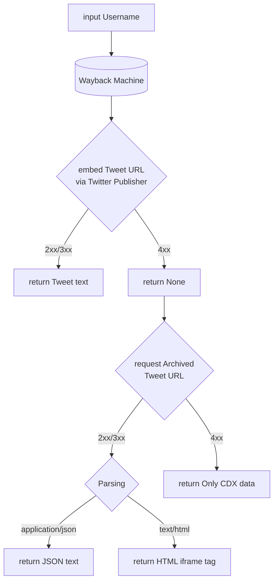

{width="150" .logo-center}

# Wayback Tweets

Retrieves archived tweets' CDX data from the Wayback Machine, performs necessary parsing, and saves the data.

## Workflow

```mermaid
flowchart TB
    A[input Username] --> B[(Wayback Machine)]
    B --> C{embed Tweet URL\nvia Twitter Publisher}
    C --> |2xx/3xx| D[return Tweet text]
    C --> |4xx| E[return None]
    E --> F{request Archived\nTweet URL}
    F --> |2xx/3xx| I{Parsing}
    F --> |4xx| G[return Only CDX data]
    I --> |application/json| J[return JSON text]
    I --> |text/html| K[return HTML iframe tag]
```
